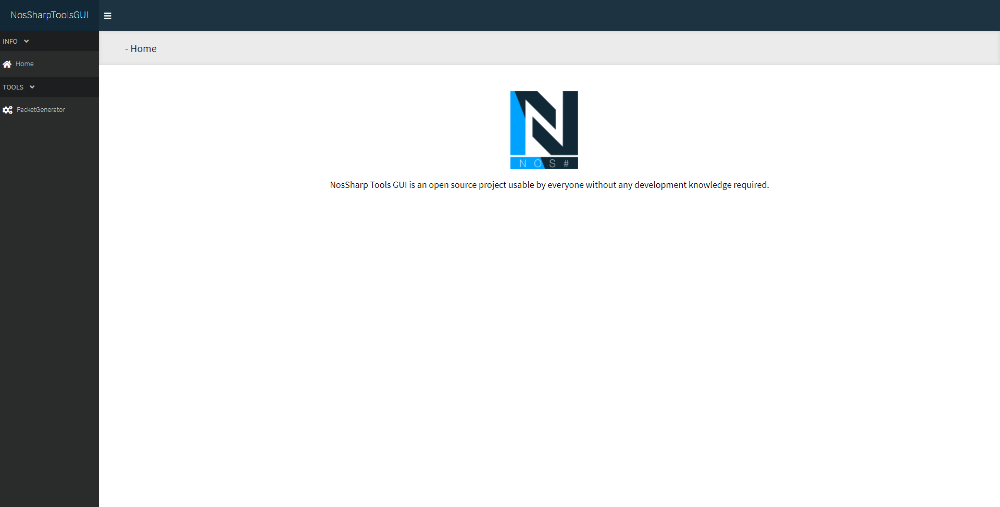
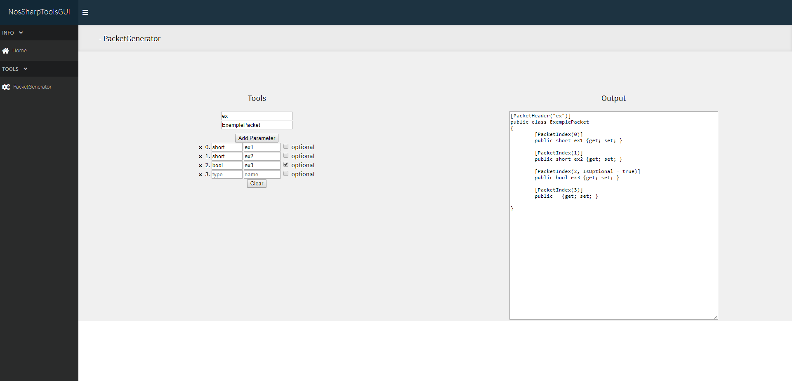

# NosSharpToolsGUI

[](https://forthebadge.com)

## Description

NosSharpToolsGUI is a graphical interface made with VueJS that allows you to do multiple things related to NosSharp and ChickenAPI development

## How to run it ?

``` bash
# install dependencies
npm install

# serve with hot reload at localhost:8080
npm run dev

# build for production with minification
npm run build
```

## How to add a tool ?

1. Create your vue component in ``src\components\{tool group}`` 
2. Add details of your tool in ``src\assets\tools.json``
 if your group is already created, simply add an new object in ``childs``
``` json
{
  "name": "",
  "open": "",
  "icon": "",
  "childs": [{
      "name": "",
      "icon": "",
      "routerLink": ""
    }
  ]
}
```

You can find icons here : https://fontawesome.com/icons?d=gallery&m=free
``ex: fas fa-home``

Your tool has been added, congratulations!

## ScreenShots

</img>
</img>